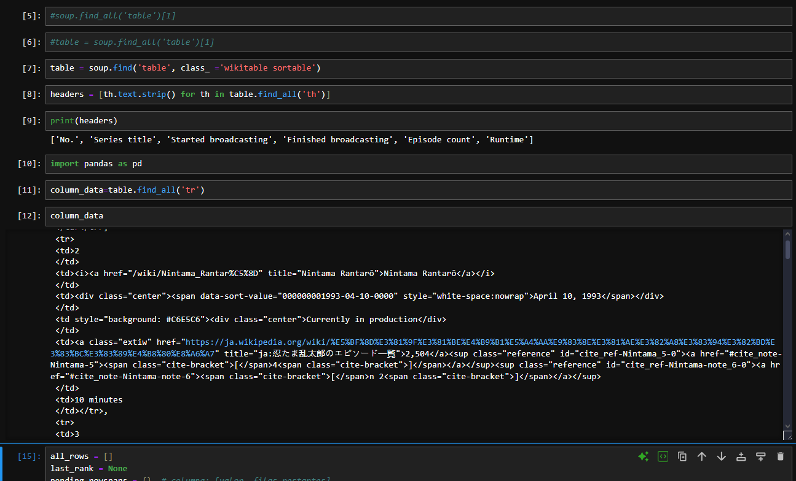
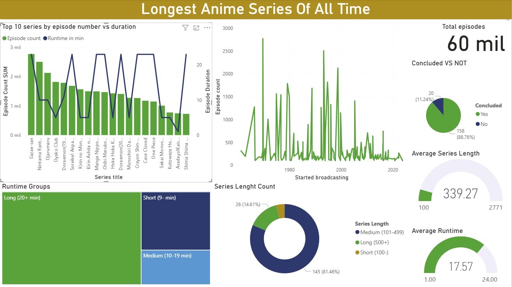

<h1 align="center">📺 Longest Anime Durations — Web Scraping & Power BI Dashboard</h1>

  <b>Scraped, cleaned and visualized durations of the longest-running anime series.</b> 
  This project scrapes a Wikipedia table of anime durations, performs data cleaning and feature engineering in a Jupyter Notebook, 
  and builds an interactive Power BI dashboard that contrasts the top 20 longest-running series with the remaining 100+ entries.

  

<h2>📄 Project Summary</h2>

  The goal of this project is to explore how the top 20 longest-duration anime differ from the rest of the dataset in terms of total runtime, 
  episodes, and average episode length. The workflow includes: web scraping, data cleaning and transformation, feature engineering, and final visualization.

<h2>⚙️ Workflow</h2>
<ol>
  <li><b>Web scraping:</b> Collected the table of longest anime durations from a Wikipedia page using Python (requests + BeautifulSoup / or pandas.read_html).</li>
  <li><b>Cleaning & preprocessing:</b> Performed in a Jupyter Notebook:
    <ul>
      <li>Parsed and standardized duration formats (e.g., total minutes, episodes).</li>
      <li>Handled missing or malformed values and removed duplicates.</li>
      <li>Created derived columns (runtime brackets, average episode length, category flags such as <code>is_top20</code>).</li>
    </ul>
  </li>
  <li><b>Visualization:</b> Loaded the cleaned dataset into Power BI and built an interactive dashboard:
    <ul>
      <li>Overview KPIs: total entries, average runtime, median episodes.</li>
      <li>Contrast view: comparison between <b>Top 20</b> vs <b>Others (100+)</b> for runtime, episodes and avg episode length.</li>
      <li>Distribution visuals: histograms and boxplots to show spread and outliers.</li>
      <li>Sortable table and filters for Length.</li>
    </ul>
  </li>
</ol>

<h2>📁 Repository Contents</h2>
<ul>
  <li><code>notebooks/</code> — Jupyter Notebook(s) with scraping and cleaning code (<code>Web_Scraping_Project.ipynb</code>.</li>
  <li><code>data/</code> — Cleaned CSV ready for visualization (<code>anime.csv</code>).</li>
  <li><code>powerbi/</code> — Power BI file (<code>AnimeDashboard.pbix</code>) and exports used for the dashboard.</li>
  <li><code>assets/</code> — Images and screenshots for the README (<code>Anime.png</code>, Scrapping).</li>
  <li><code>README.html</code> — This file (HTML version) for repository presentation.</li>
</ul>

<h2>🔎 Key Features & Insights</h2>
<ul>
  <li>Clear contrast between top 20 longest-running anime and the remaining dataset: total runtime, episodes, and average episode length.</li>
  <li>Interactive filters to inspect .</li>
  <li>Outlier detection to identify exceptionally long series and verify data quality.</li>
  <li>Reproducible pipeline: from web scraping to cleaned CSV to Power BI dashboard.</li>
</ul>

<h2>🛠️ How to Reproduce</h2>
<ol>
  <li>Install dependencies (suggested):
    <pre><code>pip install pandas beautifulsoup4 requests jupyter</code></pre>
  </li>
  <li>Run the scraping notebook to recreate the raw table from Wikipedia (or use <code>Anime.csv</code> if you prefer).</li>
  <li>Open and execute the cleaning notebook to transform raw data into the cleaned CSV.</li>
  <li>Open <code>AnimeDashboard.pbix</code> in Power BI Desktop and reload the cleaned CSV as the data source to regenerate visuals.</li>
</ol>

  

<h2>📁 Data Source</h2>

  The original table was scraped from a Wikipedia page listing anime durations.  
  Replace the placeholder link below with the actual URL you used:
   
  <a href="https://en.wikipedia.org/wiki/List_of_anime_series_by_episode_count" target="_blank"><b>📚 Source: Wikipedia — Longest Anime Durations</b></a>

<h2>🧠 Notes</h2>

  This project demonstrates end-to-end data work: web scraping, cleaning, feature engineering, and business-ready visualization.  
  The pipeline is reproducible and designed to be extended (e.g., add more metadata like genre, studio, or broadcast years).

<h2>📄 License</h2>

  This project is released under the MIT License. Use and modify freely.

